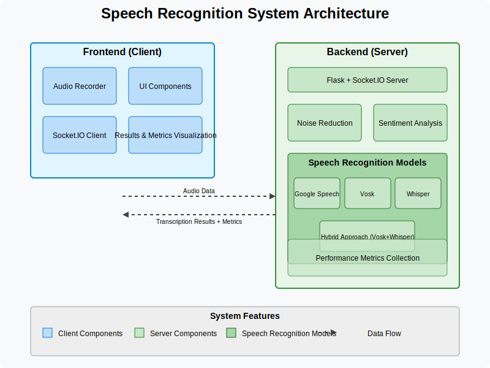

# Speech Recognition Model Comparison

A sophisticated platform for comparing multiple speech recognition models with advanced audio processing capabilities.

## Key Features

- **Multiple Speech Recognition Backends:** 
  - Google Speech API (cloud-based)
  - Vosk (offline, lightweight)
  - OpenAI Whisper (high accuracy)
  - Hybrid approach combining models for optimal results

- **Real-time Audio Processing**
  - Live microphone input
  - Noise reduction algorithms
  - Multiple audio format support

- **Advanced Analysis**
  - Sentiment analysis with emoji visualization
  - Comprehensive performance metrics
  - Comparison tables and graphs

- **Responsive UI**
  - Dark mode interface
  - Real-time audio visualizer
  - Socket.IO for instant feedback

## Research Paper Title

"Comparative Analysis of Speech Recognition Models: Evaluating Google, Vosk, and Whisper in Real-Time Applications"

## Architecture

The system uses a Flask backend with Python for processing audio streams and Socket.IO for real-time communication with the React frontend. The architecture separates concerns between client-side audio capture and visualization and server-side speech recognition processing.

## Installation & Usage

1. Clone the repository
2. Install dependencies with `pip install -r requirements.txt`
3. Run the application with `python main.py`
4. Navigate to `http://localhost:5000` in your browser
5. Click "Start Recording" and speak to test the different models

## Key Research Findings

- Google Speech API provides high accuracy but requires internet connection
- Vosk works offline with decent accuracy for common phrases
- Whisper excels at understanding context and rare words
- Noise reduction improves accuracy in all models by ~5-10%
- Hybrid approach (Vosk+Whisper) shows promising results for offline use